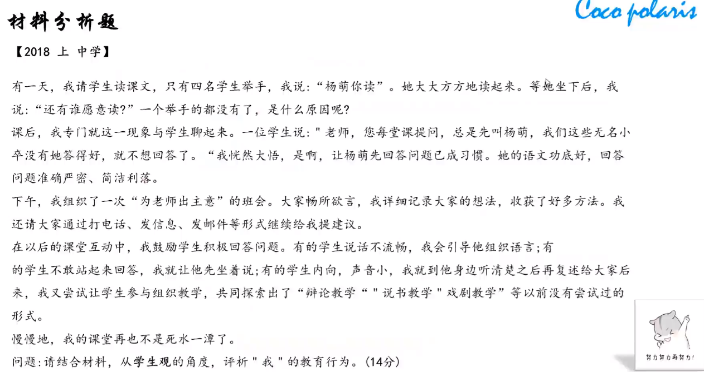

# 职业理念之教育观

## 素质教育的基本内涵

1. 素质教育是以**提**高国民**素**质为根本宗旨的教育
2. 素质教育是面向**全体**学生的教育
3. 素质教育是促进学生**全面**发展的教育
4. 素质教育是促进学生**个性**发展的教育
5. 素质教育是以培养学生的**创**新精神和实践能力为重点的教育

<u>口诀：提素个性创两全</u>

> 注：第一点不常出现在分析题的答案中

## 新课改下的教学观

1. 教学从“以教育者为中心”向“以**学**习者为中心”转变
2. 教学从“教会学生知识”向“教会学生学**习**”转变
3. 教学从“重结论轻过程”向“重结论更重**过**程”转变
4. 教学从“关注学科”向“关注**人**”转变

<u>口诀：学习过人</u>

## 例题1

### 答题模板

答题遵循**总-分-总**的结构，**3-4**个理论点

| 材料中老师的教育行为是正确的（错误的），遵循了（违背了）素质教育观的相关要求，值得我们学习（希望老师们引以为戒）。 首先，【观点一】，【一句话解释】。材料中。。。【引用材料】 其次，【观点二】，【一句话解释】。材料中。。。【引用材料】 最后，【观点三】，【一句话解释】。材料中。。。【引用材料】 综上所述，作为老师，我们应该践行素质教育观，。。。【挑出前面说的几个观点说一说】 |
| :----------------------------------------------------------- |

# 职业理念之学生观

## 学生观

1. 学生是**独**立意义的人
   1. 学生具有独立个性，不以教师意志为转移
   2. 学生是具有独立意义的主体，不以教师的意志为转移
   3. 学生是责权的主体
2. 学生是**独**特的人
   1. 学生是完整的人
   2. 每个学生都具有自身的独特性
   3. 学生与成人之间存在巨大的差异
3. 学生是**发**展的人
   1. 学生的身心发展是有规律的
   2. 学生具有巨大的发展潜能
   3. 学生是处于发展过程中的人
4. **全**面发展
   1. 德智体美劳全面发展
5. 面向**全**体学生
   1. 公平公正对待每个学生，不能偏爱某个学生

<u>口诀：两独一发+两全</u>

## 例题1

### 答题模板

答题遵循**总-分-总**的结构，**3-4**个理论点

| 材料中老师的教育行为是正确的（错误的），遵循了（违背了）素质教育观的相关要求，值得我们学习（希望老师们引以为戒）。 首先，“以人为本”的学生观认为学生是发展的人【观点】，具有巨大的发展潜能。【一句话解释】材料中。。。【引用材料】 其次，“以人为本”的学生观认为学生是独特的人【观点】，每个学生都具有自身的个性与差异性。【一句话解释】材料中，。。。【引用材料】 最后，“以人为本”的学生观认为学生是具有独立意义的人【观点】，学生是独立意义的主体，不以老师的意志为转移。【一句话解释】材料中。。。【引用材料】 综上所述，作为老师，我们应该。。。，做到“一切为了每一个学生的发展”。 |
| ------------------------------------------------------------ |

## 学生的身心发展是有规律的

1. 顺序性
   1. 循序渐进
2. 阶段性
   1. 童年：具体性、形象性、抽象思维较弱
   2. 少年：抽象思维有很大的发展，但仍需要感性经验作为支撑
3. 不平衡性
   1. 不是匀速前进
4. 互补性
   1. 身心互补
5. 个别差异性
   1. 有的人聪明早慧，有的人大器晚成

<u>以上多以选择题的形式考察</u>

## 教育的公正与学生的共同发展

1. 教育公正
   1. 教育机会对于所有学生来说都是均等的
2. 共同发展
   1. 有差异的学生共同发展

